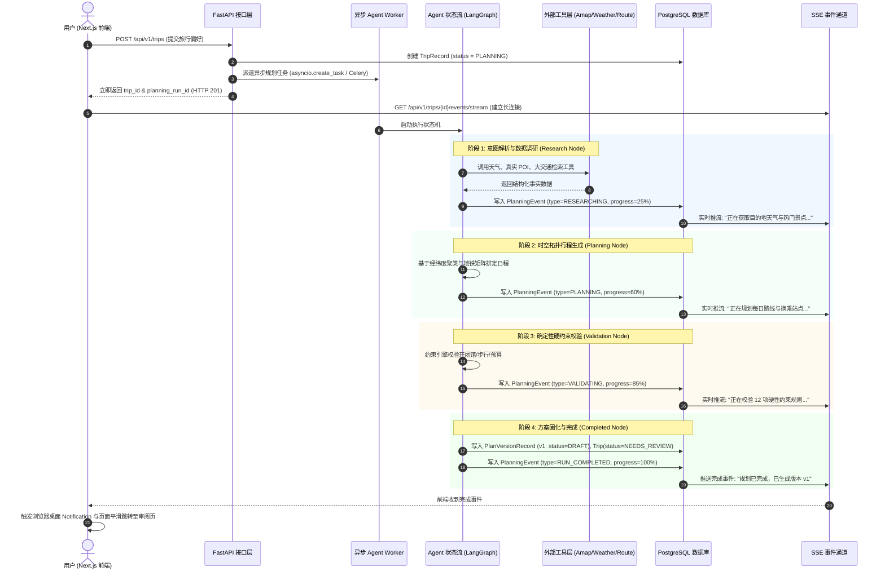

# TravelMind 系统重构与关键问题解决方案技术设计文档

> **版本**：v1.0  
> **编制日期**：2026-08-19  
> **适用范围**：TravelMind 核心架构演进、前端纯数据驱动重构、真实外部 API 接入、用户认证系统以及 Agent 异步流式调度流水线。

---

## 目录

1. [背景与前置修复成果](#1-背景与前置修复成果)
2. [问题（1）：跨城初始交通方式（高铁/大巴/飞机）的可靠数据方案](#2-问题1跨城初始交通方式高铁大巴飞机的可靠数据方案)
3. [问题（2）：地点位置数据前端硬编码解决方案与新增领域模型设计](#3-问题2地点位置数据前端硬编码解决方案与新增领域模型设计)
4. [问题（3）：国内外 POI 评分、推荐菜、实拍照片与精准换乘 API 调研与接入方案](#4-问题3国内外-poi-评分推荐菜实拍照片与精准换乘-api-调研与接入方案)
5. [问题（4）：用户创建/注册/登录/注销体系与全局消息提醒设计](#5-问题4用户创建注册登录注销体系与全局消息提醒设计)
6. [问题（5）：真实 Agent 任务派遣、实时事件流（SSE）与完成提醒方案](#6-问题5真实-agent-任务派遣实时事件流sse与完成提醒方案)
7. [演进落地路线图（Roadmap）](#7-演进落地路线图roadmap)

---

## 1. 背景与前置修复成果

针对当前系统中存在的视觉布局和时区偏差问题，本次已完成以下核心修复：
1. **最终计划页面交通方式布局重构**：
   - 将 `.activityRow` 栅格从固定宽度的挤压式布局调整为响应式伸缩结构；
   - 限制交通换乘摘要文字（`.transitBadge`）的最大宽度，设置 `word-break: break-word` 与 `overflow-wrap: anywhere` 自动换行；
   - 彻底解决了行程标题文字被挤压成每行仅 2-3 个字的排版 Bug。
2. **时区与游玩时间校准**：
   - 发现并修正了种子数据以 UTC 构造导致的北京时间（UTC+8）二次偏移问题（原 09:30 偏移为 17:30~04:00）；
   - 后端全部统一采用标准中国标准时间（`CST = timezone(timedelta(hours=8))`），前端 `formatTime` 动态绑定行程目标地时区（如 `Asia/Shanghai`），确保每日行程严格按照上午 09:00 至晚上 21:00 合理游玩。
3. **右侧地图多日联动修复**：
   - 修复了 `MiniRouteMap` 默认写死 5 个测试点位且不随切日更新的问题；
   - 在地图卡片顶部增加了 `Day 1 ~ Day N` 切日切换器，点击左侧行程卡片折叠或右侧天数按钮时，地图自动同步高亮并飞行聚焦至当天真实活动轨迹与途经点。

---

## 2. 问题（1）：跨城初始交通方式（高铁/大巴/飞机）的落地方案（文档设计，暂不实现）

### 2.1 交互设计：在“创建旅行任务”第一模块（基本信息/出行方式）中提供双轨选择

在创建旅行的第一模块中，为用户提供两种跨城交通输入模式：

```text
┌─────────────────────────────────────────────────────────────────────────┐
│ 创建旅行任务 - 第一区块：基础信息与城际出行方式                            │
├─────────────────────────────────────────────────────────────────────────┤
│ 出行方式选择： [ ○ 手动精确填写 ]    [ ● Agent 智能联网搜索与估算 ]         │
│                                                                         │
│ ┌─────────────────────────────────────────────────────────────────────┐ │
│ │ 选项 1：用户手动填写（精确规划 / 时间与预算直接锁定）                 │ │
│ │  - 交通方式：[ 高铁 / 动车 / 飞机 / 长途大巴 / 自驾 ]               │ │
│ │  - 班次/车次：如 G14 / MU5101                                        │ │
│ │  - 始发与到达站：如 上海虹桥站 → 北京南站                            │ │
│ │  - 抵离时刻：出发 2026-10-01 08:00，抵达 2026-10-01 12:30          │ │
│ │  - 票价费用：如 ¥623 / 人                                           │ │
│ └─────────────────────────────────────────────────────────────────────┘ │
│                                                                         │
│ ┌─────────────────────────────────────────────────────────────────────┐ │
│ │ 选项 2：Agent 联网搜索 + 数据估算（智能参考）                        │ │
│ │  - 交通偏好：[ 智能推荐 / 优先高铁 / 优先直飞航班 / 经济出行 ]       │ │
│ │  - ⚠️ 明确提示与免责声明：                                           │ │
│ │    “本模式由 Agent 结合全网数据进行实时搜索与智能基准估算，为您提供    │ │
│ │     参考车次、抵离时间及预估票价。受航司/12306实时票态与节假日波动影响│ │
│ │     数据可能与实际出票存在偏差，仅供行程规划参考，不保证与实际一致。”│ │
│ └─────────────────────────────────────────────────────────────────────┘ │
└─────────────────────────────────────────────────────────────────────────┘
```

### 2.2 Agent 规划调度与数据流逻辑

1. **模式 1：用户手动填写（精确规划模式）**：
   - **调度行为**：Agent **直接使用现成数据**，将其作为确定性的**时间锚点（Fixed Anchor）**；
   - **日程排定**：第一天行程的起始点与时间严格锚定在用户填写的到达枢纽（如 `北京南站`）和到达时刻（如 `12:30`），返程日严格以用户出发站和发车时间为截止点；
   - **预算计算**：直接将用户输入的交通费用计入 `budget.totals_by_category["intercity_transport"]`。

2. **模式 2：Agent 联网搜索 + 数据估算（估算模式）**：
   - **调度行为**：Agent 在调研阶段（Research Node）调用联网搜索工具（Search MCP / 聚合时刻 API），检索出发地至目的地之间的推荐标杆车次/直飞机票与参考基准票价；
   - **数据标记**：生成的 `RouteLeg` 和行程卡片上明确标注 `is_estimated: true`（“*AI 估算数据，以实际出票为准*”），避免误导用户；
   - **数据流闭环**：若网络检索超时或无结果，基于两地空间距离与交通偏好自动估算旅行耗时（如京沪高铁按 4.5h 估算，票价按基准 ¥600/人 估算）完成规划闭环。

### 2.3 领域与请求模型设计规范（待后续迭代实现）

```python
class IntercityTransportMode(StrEnum):
    """大交通输入模式"""
    MANUAL = "manual"                  # 用户手动输入精准数据
    AGENT_ESTIMATED = "agent_estimated"# Agent 联网搜索与估算

class ManualTransportLeg(DomainModel):
    """用户手动填写的单程大交通信息"""
    mode: TransportMode                # FLIGHT / PUBLIC_TRANSIT / DRIVING / HIGH_SPEED_RAIL
    carrier_or_code: str | None = None # 车次/航班号 (如 G14 / MU5101)
    departure_station: str             # 出发站 (如 上海虹桥站)
    arrival_station: str               # 到达站 (如 北京南站)
    departure_time: datetime           # 出发时间 (带时区)
    arrival_time: datetime             # 到达时间 (带时区)
    cost: Money                        # 票价/人均花费

class IntercityTransitPreference(DomainModel):
    """旅行创建请求中的大交通配置"""
    input_mode: IntercityTransportMode = IntercityTransportMode.AGENT_ESTIMATED
    manual_outbound: ManualTransportLeg | None = None   # 手动去程信息
    manual_inbound: ManualTransportLeg | None = None    # 手动返程信息
    preferred_mode: TransportMode = TransportMode.PUBLIC_TRANSIT # 估算模式偏好
    disclaimer_acknowledged: bool = True               # 是否已确认估算数据免责声明
```

---

## 3. 问题（2）：地点位置数据前端硬编码解决方案与新增领域模型设计

### 3.1 核心思想：消除前端字典，实行纯领域模型下发
前端的 `KNOWN_PLACE_COORDS` 和 `PLACE_COORDINATES` 静态字典属于典型的反模式。正确的架构应该是：**后端的规划结果（Itinerary）本身就是自包含的，或者携带完整的地点实体表（Places Lookup Table），前端纯粹作为渲染层。**

### 3.2 新增与调整的领域模型

#### 1. 扩展 `Activity` 领域模型（自包含定位与展示数据）
在 `backend/app/domain/itinerary.py` 中为 `Activity` 增加地点坐标、地址与实拍缩略图：

```python
class Activity(DomainModel):
    """单项日程活动模型"""
    id: UUID
    kind: ActivityKind
    title: str
    place_id: str | None = None
    
    # === 新增领域字段：实体地理与视觉元数据 ===
    location: GeoLocation | None = None          # 经纬度坐标 (latitude, longitude)
    address: str | None = None                  # 物理门牌地址 (用于导航与卡片展示)
    photo_url: str | None = None                # 真实地点代表性高清实拍图 URL
    rating: float | None = None                 # 权威评分 (如 4.8)
    
    start_at: datetime
    end_at: datetime
    route_leg_id: UUID | None = None
    estimated_cost: Money
    priority: int = 50
    locked: bool = False
    indoor_outdoor: IndoorOutdoor = IndoorOutdoor.INDOOR
    reason: str | None = None
    notes: list[str] = Field(default_factory=list)
    source_type: ActivitySourceType = ActivitySourceType.PLANNER
```

#### 2. 在 `CurrentPlanResponse` 与 `Itinerary` 增加 `places` 实体字典（推荐）
在 `backend/app/domain/research.py` 与 `backend/app/api/schemas.py` 中：

```python
class PlaceSummary(DomainModel):
    """地点轻量实体概要，供前端地图打点与悬浮卡片展示"""
    id: str
    name: str
    category: PlaceCategory
    location: GeoLocation
    address: str | None = None
    rating: float | None = None
    photo_url: str | None = None
    tags: list[str] = Field(default_factory=list)

class Itinerary(DomainModel):
    trip_id: UUID
    title: str
    destination: str
    timezone: str
    date_range: DateRange
    days: list[DayPlan] = Field(default_factory=list)
    places: dict[str, PlaceSummary] = Field(default_factory=dict)  # place_id -> PlaceSummary
    budget: BudgetSummary
    general_notes: list[str] = Field(default_factory=list)
    generated_at: datetime
```

### 3.3 前端改造
1. 前端组件直接从 `activity.location` 或 `plan.itinerary.places[activity.place_id].location` 中提取 `lat` 与 `lng`；
2. **彻底删除** `final-itinerary.tsx` 和 `current-plan.tsx` 中的 `KNOWN_PLACE_COORDS` 与 `PLACE_COORDINATES`，实现 100% 后端数据驱动。

---

## 4. 问题（3）：国内外 POI 评分、推荐菜、实拍照片与精准换乘 API 调研与接入方案

| 业务维度 | 国内权威 API 推荐 | 海外权威 API 推荐 | 数据内容与技术特性 |
|---|---|---|---|
| **旅游景点** (评分/实拍图/介绍) | **高德 Web 服务 API (POI 搜索 2.0 / 详情)**<br>百度地图 Place API | **Google Places API (New)**<br>TripAdvisor Content API | 提供权威评分（如 4.7）、高清实拍照片（`photos[].url`）、开放时间、门票价格及经纬度。 |
| **特色餐饮** (评分/推荐菜/门头照) | **美团/大众点评开放平台 API**<br>高德深度餐饮 POI | **Yelp Fusion API**<br>Foursquare Places API | 提供大众点评黑珍珠/必吃榜星级、人均消费、招牌特色菜列表（Top 3）、店内与门头实拍图。 |
| **酒店住宿** (星级/评分/实拍图) | **携程开放平台 API**<br>高德酒店行业 POI | **Booking.com Demand API**<br>Amadeus Hotel Search API | 提供酒店星级、综合评分、大堂及房型照片、最低参考价、距离最近地铁站步行距离。 |
| **公共交通换乘** (地铁/公交/出口) | **高德路径规划 (Integrated Transit 2.0)**<br>腾讯地图公交规划 | **Google Directions API (Transit)** | 精确到地铁线路（如 `地铁1号线`）、上下车站名、换乘通道、出口编号（如 `6号口`）及步行接驳距离。 |

### 4.1 统一 Provider 适配器架构设计
在后端 `backend/app/providers/` 下建立统一的多源适配体系：
- `poi/amap_poi_provider.py`：高德国内 POI 适配器（实现景点、餐厅、酒店查询与照片提取）；
- `poi/google_places_provider.py`：Google Places 海外 POI 适配器；
- `transit/amap_transit_provider.py`：高德公共交通换乘与地铁站点解析器；
- `transit/google_transit_provider.py`：Google Directions 换乘解析器。

通过统一接口 `POIService` 与 `TransitService` 屏蔽国内外差异，根据 `Trip.request.destination` 自动智能切换国内/海外数据源。

---

## 5. 问题（4）：用户创建/注册/登录/注销体系与全局消息提醒设计

### 5.1 数据表设计 (`backend/app/persistence/schema.py`)

```python
class UserTable(Base):
    """用户主表"""
    __tablename__ = "users"

    id: Mapped[UUID] = mapped_column(primary_key=True, default=uuid4)
    username: Mapped[str] = mapped_column(String(50), unique=True, index=True, nullable=False)
    email: Mapped[str] = mapped_column(String(100), unique=True, index=True, nullable=False)
    password_hash: Mapped[str] = mapped_column(String(255), nullable=False)
    full_name: Mapped[str | None] = mapped_column(String(100), nullable=True)
    avatar_url: Mapped[str | None] = mapped_column(String(500), nullable=True)
    is_active: Mapped[bool] = mapped_column(Boolean, default=True, nullable=False)
    created_at: Mapped[datetime] = mapped_column(DateTime(timezone=True), default=utc_now, nullable=False)
    updated_at: Mapped[datetime] = mapped_column(DateTime(timezone=True), default=utc_now, onupdate=utc_now, nullable=False)

    trips: Mapped[list["TripTable"]] = relationship("TripTable", back_populates="user", cascade="all, delete-orphan")
```

在 `TripTable` 中增加外键关联：
```python
user_id: Mapped[UUID | None] = mapped_column(ForeignKey("users.id", ondelete="SET NULL"), nullable=True, index=True)
user: Mapped["UserTable | None"] = relationship("UserTable", back_populates="trips")
```

### 5.2 认证接口与 JWT 鉴权 (`backend/app/api/v1/auth.py`)
- `POST /api/v1/auth/register`：输入用户名、邮箱、密码，创建用户并自动返回 JWT Token；
- `POST /api/v1/auth/login`：OAuth2 标准密码表单登录，校验密码哈希并签发 `access_token`（默认 7 天有效）；
- `POST /api/v1/auth/logout`：注销登录；
- `GET /api/v1/auth/me`：获取当前登录用户信息与权限。
- 依赖注入：`CurrentUserDep = Annotated[UserRecord, Depends(get_current_user)]`，在所有涉及旅行创建、修改的接口中注入，自动实现多租户数据隔离。

### 5.3 前端用户状态与消息提醒
1. **全局 AuthContext (`frontend/src/context/AuthContext.tsx`)**：
   - 存储 `user` 对象、`token`，并在应用加载时自动从 `localStorage` 恢复登录态；
   - 暴露 `login()`, `register()`, `logout()` 方法。
2. **全局 Toast / Notification 机制 (`frontend/src/components/ui/Toast.tsx`)**：
   - 支持 `success`、`error`、`warning`、`info` 四种状态提示；
   - 注册成功、登录成功、密码错误、Token 过期时触发即时友好反馈。

---

## 6. 问题（5）：真实 Agent 任务派遣、实时事件流（SSE）与完成提醒方案

### 6.1 端到端异步闭环工作流



### 6.2 关键实现细节
1. **真实后台任务派发**：
   - 绝不阻塞 HTTP 请求线程；采用 `asyncio.create_task(run_agent_pipeline(...))` 或后台队列 Worker 调度执行。
2. **SSE 实时流端点 (`backend/app/api/v1/planning.py`)**：
   - 使用 `StreamingResponse` 监听数据库或异步 Queue 中的 `PlanningEventRecord`，格式化为 `data: {"sequence": 1, "step": "research", "message": "...", "progress": 25}\n\n` 输出。
3. **前端 PlanningProgress 页面实时呈现**：
   - 前端接收到 SSE 数据流后，动态驱动环形进度条、阶段步骤高亮以及日志滚动控制台；
4. **完成时消息与多端提醒**：
   - 监听到 `RUN_COMPLETED` 时，播放轻微提示音，触发全局 Toast 并调用 `Notification.requestPermission()` 弹出系统桌面通知；
   - 自动无缝跳转到 `/trips/[id]/adjust` 或 `/trips/[id]/final` 进行审阅。

---

## 7. 演进落地路线图（Roadmap）

```text
阶段 1: 视觉与时区修复 (已完成 100%)
  ├─ 修复最终计划交通换乘卡片样式与换行
  ├─ 修复 CST/UTC 时区造成的时间错乱
  └─ 修复右侧地图多日切换与交互联动

阶段 2: 领域模型与纯数据驱动 (下阶段优先)
  ├─ 在 Activity / Itinerary 中增加 location 与 PlaceSummary 模型
  ├─ 清除前端所有硬编码地点经纬度字典
  └─ 数据库迁移与转换器适配

阶段 3: 真实 API 适配集成
  ├─ 接入高德 Web 服务 POI 搜索与公交换乘 Transit 2.0 API
  ├─ 接入大交通车次/航班数据源适配器
  └─ 实现国内外多源自动分流

阶段 4: 用户认证与数据隔离体系
  ├─ 实现 UserTable 与 JWT 鉴权接口
  ├─ 前端 AuthContext 与登录/注册弹窗
  └─ 旅行数据的用户级隔离与权限控制

阶段 5: Agent 异步调度与 SSE 流式反馈
  ├─ 封装 LangGraph 端到端执行流水线
  ├─ 实现 SSE /events/stream 实时推流接口
  └─ 前端进度可视化与浏览器桌面通知
```
